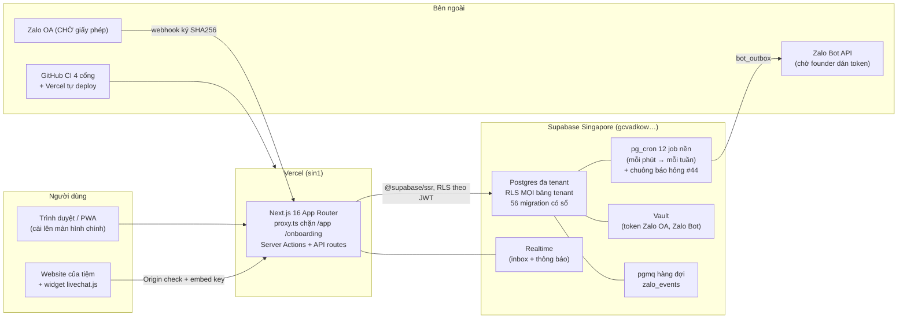
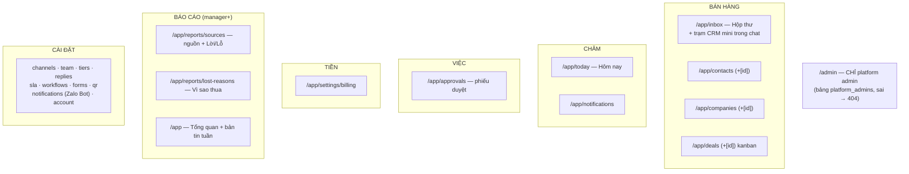
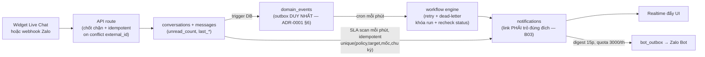
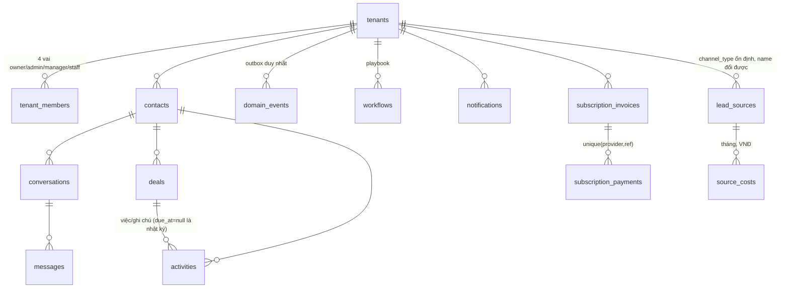

# Sơ đồ hệ thống iFan — bản vẽ nhà cho mọi trợ lý

Cập nhật: 11/08/2026 (sau đợt 2). **Ai làm việc trên kho này đọc file này TRƯỚC**, rồi mới tới
[SU-THAT-SAN-PHAM.md](SU-THAT-SAN-PHAM.md) (tính năng nào chạy thật) và [adr/](adr/) (vì sao quyết thế).
Cần tra sâu "hàm này ai gọi": dùng GitNexus (kho đã lập chỉ mục), đừng cào file.

## 1. Sơ đồ tổng thể



**Luật vùng:** DB + web cùng Singapore. Dự án Mumbai đã xóa hẳn 12/08 (founder tự xóa, không còn đường lùi). KHÔNG đụng project hieu.asia.

## 2. Bản đồ màn theo 6 trục (nav /app)



Route công khai: `/` landing · `/livechat-demo?key=` trang thử · `/q/[code]` QR · `/privacy` `/terms` · auth (`/login /signup /forgot-password /reset-password /invite/[token] /onboarding`).
API: `api/livechat/{session,message,poll}` (origin + embed key + rate-limit fail-closed) · `api/webhooks/zalo` (chữ ký SHA256, sai = 401) · `api/bot/{webhook,outbox}` (Zalo Bot).

## 3. Ba luồng dữ liệu lõi (sửa gì cũng phải giữ nguyên hình các luồng này)

### 3a. Tin nhắn vào → việc phải làm


### 3b. Tiền (mọi bước idempotent)
```
Chọn gói → subscription_invoices(open) → màn billing hiện hóa đơn + STK (platform_settings)
→ khách chuyển khoản → founder /admin bấm "Đã nhận tiền"
→ admin_record_payment → record_subscription_payment  [on conflict (provider,ref) → 'duplicate', KHÔNG ghi 2 lần]
→ gói bật (billing_apply_invoice) + thông báo. Vòng đời trial→active→past_due→suspended: cron ngày.
```

### 3c. Nguồn → tiền (attribution)
```
QR (/q/[code], source_id riêng) ──┐
channel_type (zalo/livechat…) ────┼→ contacts.source_id → deals → reports/sources
nhập tay/Excel ───────────────────┘         + source_costs (nhập tay) → cột Lời/Lỗ
```

## 4. Dữ liệu lõi (ERD rút gọn — chỉ xương sống)


Bảng nền tảng (không thuộc tenant): `platform_admins`, `platform_settings`, `system_alerts`, `cron_scan_state`.

## 5. Bất biến — vi phạm là bug (đã có vết sẹo thật cho từng dòng)

1. **RLS mọi bảng tenant, mặc định TỪ CHỐI**; ẩn nút UI chỉ là lịch sự. Hàm SQL: đúng loại security + `set search_path = public, pg_temp` (create-or-replace GHI ĐÈ config — quên là tự tháo chốt #40).
2. **Re-create hàm SQL phải chép từ bản MỚI NHẤT** trong migrations (đã dính regression 2 lần). Bản mới nhất hiện tại: xem file migration số lớn nhất có hàm đó.
3. **Một hành động lõi một đường code** (tạo khách, ghi việc, gắn nguồn) — mỗi màn tự chế đường riêng là gốc bệnh số-liệu-đá-nhau.
4. **Bấm lại vô hại**: mọi nút ghi, webhook, nhập file đều idempotent (on conflict / biên nhận).
5. **Migration**: file mới đánh số tiếp, áp bằng **`node scripts/ap-migration.mjs <version>`** (TLS ghim CA, áp + ghi sổ `schema_migrations` trong CÙNG transaction), không sửa file cũ. Soát bất cứ lúc nào: `node scripts/ap-migration.mjs --kiem` — CI chạy nó mỗi lần push.
   > ⚠️ **Bất biến này từng là chữ suông 5 ngày.** Tới 17/08 nó vẫn ghi "áp qua node script chuẩn" mà **script đó chưa từng tồn tại** (tìm cả cây thư mục lẫn toàn bộ lịch sử git). Hệ quả đo được: sổ dừng ở #84 trong khi kho đã có #130 — **44 bản áp thẳng không ghi sổ**, không gì báo. Đã ghi bù 47 dòng và viết công cụ thật ngày 17/08. **Lần thứ TƯ trong một tuần dự án trỏ vào công cụ không có thật** (`check-ds.mjs`, ADR-0003, việc #117, cái này) ⇒ khi viết một bất biến nhắc tới công cụ, **mở thư mục ra kiểm công cụ đó có thật không**.
6. **D1 — mỗi địa chỉ khai báo MỘT lần** (URL, key thông báo, tên sự kiện) — nơi thứ hai luôn là nơi lỗi thời.
7. **i18n đủ vi+en** cho mọi chuỗi UI; chuỗi có tham số phải test parse (ICU đã vỡ 1 lần vì "</body>").
8. **Không thêm cột/field "để dành"** khi chưa có code ghi nó (D2).
9. **Tiếng Việt trước**, giọng đời thường cho người không rành kỹ thuật; huy hiệu trạng thái TRUNG THỰC.
10. **Đừng tin lời khai, tin cổng**: xong việc = `npx tsc --noEmit` + eslint sạch; phán cuối thuộc cổng tổng (typecheck + lint + build + CI) trên cây code đã yên.
11. **Xóa mềm + Thùng rác 30 ngày cho MỌI thực thể nghiệp vụ** (khách, đơn, lịch, item, phiếu…): dùng `deleted_at` thống nhất (mẫu deals), màn Thùng rác cho owner/admin khôi phục, job đêm dọn thật sau 30 ngày. Không module nào tự chế kiểu xóa riêng.
12. **Liên kết chéo chỉ đi qua `domain_events`** — module A KHÔNG gọi thẳng module B. Thêm module mới: khai sự kiện nó PHÁT và sự kiện nó NGHE vào ma trận liên kết (Quy hoạch mục 32) TRƯỚC khi viết code. Một sự kiện có thể nhiều người nghe; người nghe hỏng không được làm hỏng người phát.
13. **Hạ tầng dùng chung là BẢN DUY NHẤT** (Quy hoạch mục 31.0 = hợp đồng 24k–24u): tệp đính kèm · tìm kiếm toàn cục · in phiếu/PDF · mã vạch-quét camera · trường tùy biến · bộ lọc lưu sẵn · nhật ký theo bản ghi · cấp số chứng từ · mẫu tin · khung giờ gửi · realtime chống ghi đè. **Module cần thứ nào thì DÙNG bản chung, cấm dựng bản riêng** — dựng riêng là nợ phải đập đi làm lại.

14. **Dữ liệu đổi được CÁCH NỐI, nhưng TẬP HÀNH ĐỘNG luôn ĐÓNG** — cho chủ tiệm bật/tắt, sắp xếp, đặt điều kiện trên một danh sách **đã khai sẵn trong code**; **cấm** cho họ tạo ra loại hành động mới bằng cấu hình. Thêm một LOẠI hành động mới ⇒ phải sửa code + migration, đó là chủ ý chứ không phải hạn chế.
    *Vì sao:* cấu hình mà làm được mọi thứ thì thành một ngôn ngữ lập trình không có ai kiểm — mỗi tiệm một kiểu dữ liệu, không báo cáo chéo được, không ai sửa nổi khi hỏng. Cấu hình mà không làm được gì thì việc gì cũng phải chờ lập trình viên.
    *Đã áp 3 lần, trước khi kịp gọi tên:* trường "Hỏi thêm" của form thu khách (chủ tiệm bật/tắt trong danh mục pack ngành, không tự tạo trường — ADR-0008 mục 7) · trạng thái lịch hẹn V2 (đúng 5 giá trị, cắt 2 giá trị không ai sinh ra — ADR-0009 mục 5) · **giết trình tạo quy trình kéo-thả** (mục 34.1).
    *Nguồn:* học từ FlowX đợt 3 (12/08) — mẫu CRM của họ cho quản trị viên viết lại quy trình bán hàng **lúc đang chạy**, nhưng tập hành động vẫn là enum đóng do trình biên dịch kiểm, **và có test canh đúng ranh giới đó**. Ta chưa có test canh; xem việc theo dõi trong vault.
    > **Vá 14/08 (Opus):** đuôi của bất biến 13 (`· mẫu tin · khung giờ gửi · realtime…`) từng lạc xuống đây, làm bất biến 13 cụt ở "cấp số chứng từ" còn bất biến 14 kết bằng một câu vô nghĩa. Đã trả về đúng chỗ. **Đúng bệnh D1 mà chính file này dạy: bản sao thứ hai luôn là bản lỗi thời — kể cả khi "bản sao" chỉ là một mẩu câu đi lạc.**

## 6. Thứ tự đọc cho trợ lý mới vào việc

**0. `C:\iFan.asia\00 Trang chủ.md` TRƯỚC TIÊN** (đang làm đợt nào · việc tiếp theo · cấm kỵ · phân vai) → 1. File này (5 phút, **14 bất biến** — đếm lại 14/08, mục 5 có 14 dòng; nhiều nơi còn ghi "13" là bản trước khi thêm bất biến 14) → 2. `SU-THAT-SAN-PHAM.md` → 3. **`adr/` — LUÔN mở ADR MỚI NHẤT trước** (nó là hồ sơ đợt đang mở và thường đính chính kế hoạch cũ; **cố ý không ghi số ADR cứng ở đây** vì con số đó chắc chắn lỗi thời sau mỗi ADR mới) → 4. thẻ thiết kế `design-system/` nếu đụng UI → 5. GitNexus query khi cần tra quan hệ sâu.
